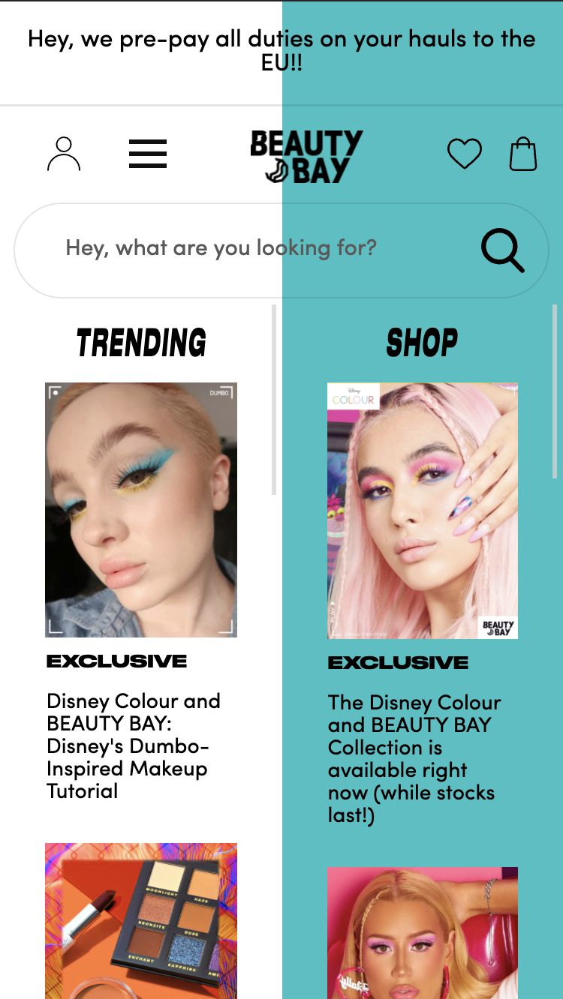
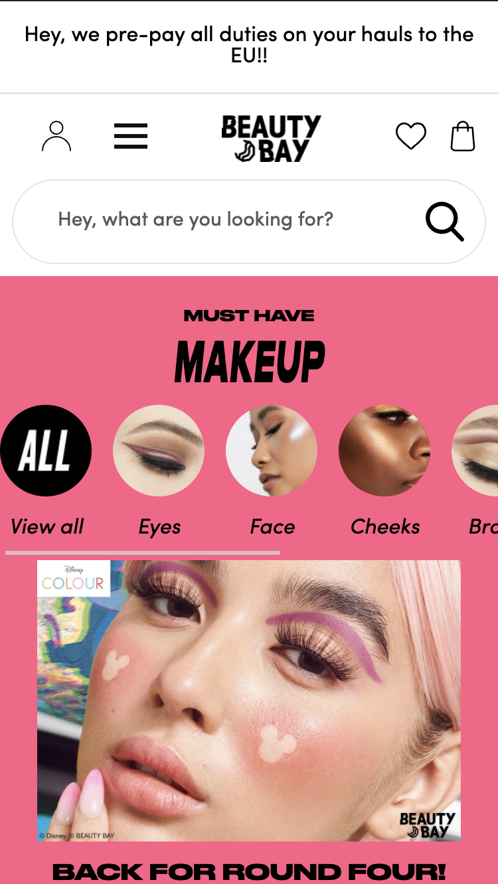
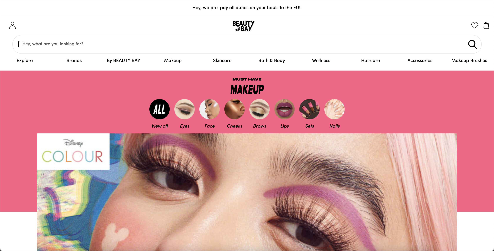
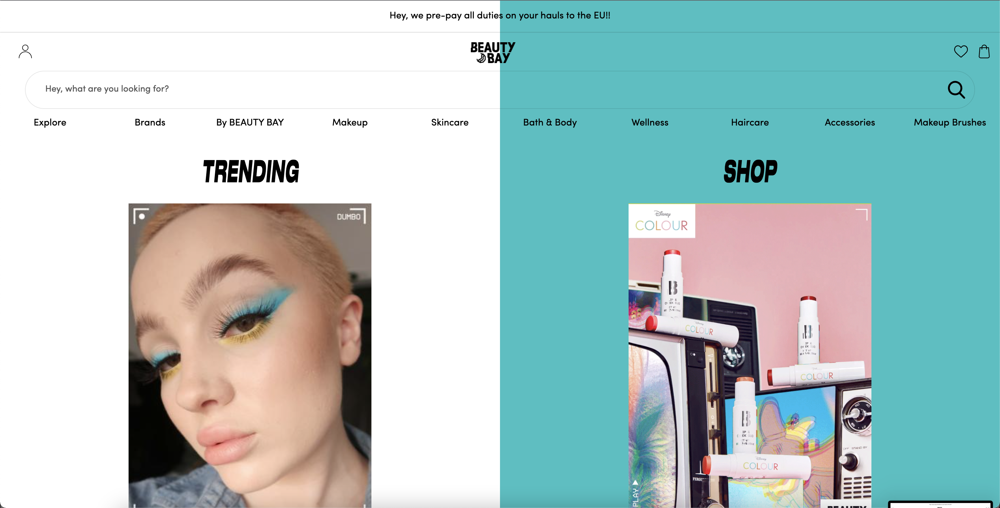

# Procesverslag
Markdown is een simpele manier om HTML te schrijven.  
Markdown cheat cheet: [Hulp bij het schrijven van Markdown](https://github.com/adam-p/markdown-here/wiki/Markdown-Cheatsheet).

Nb. De standaardstructuur en de spartaanse opmaak van de README.md zijn helemaal prima. Het gaat om de inhoud van je procesverslag. Besteedt de tijd voor pracht en praal aan je website.

Nb. Door *open* toe te voegen aan een *details* element kun je deze standaard open zetten. Fijn om dat steeds voor de relevante stuk(ken) te doen.

## Jij

uitwerken voor kick-off werkgroep

### Auteur:
Luna Hali

#### Je startniveau:
Blauw

#### Je focus:
surface plane
 

## Je website

uitwerken voor kick-off werkgroep

### Je opdracht:
link naar de website die je gaat namaken óf de naam/omschrijving van je eigen ontwerp

#### Screenshot(s) van de eerste pagina (small screen): 
Beauty Bay home pagina  

#### Screenshot(s) van de tweede pagina (small screen):
Beauty Bay make up pagina 

 

## Breakdownschets (week 1)

uitwerken na afloop 2e werkgroep

### de hele pagina: 

### dynamisch deel (bijv menu): 

## Voortgang 1 (week 2)

uitwerken voor 1e voortgang

### Stand van zaken
Het gaat redelijk goed en ik krijg veel dingen in mijn eentje voor elkaar. Het enige lastige vind ik wel is dat ik het gebruik van divjes heel fijn vind. Ik krijg het eerst niet voor elkaar om in de header de halve achtergrondkleur te plaatsen. Dit is samen met Reinier uiteindelijk gelukt, door gebruik te maken van een ::after een een z-index van -1.

### Agenda voor meeting
samen met je groepje opstellen

| Mik            | Luna               | student 3    | student 4        |
| ---            | ---                | ---          | ---              |
| Ik moet vooral | Ik moet proberen   | en ik dit    | en dan ik dat    |
| gewoon tempo   | minder divs te     | nog een punt | dit wil ik zeker |
| gaan maken     | gebruiken.         | ...          | ...              |
  zodat er meer
  staat.

### Verslag van meeting
hier na afloop snel de uitkomsten van de meeting vastleggen

- Netter werken in css
- Meer vragen stellen als je het niet snapt.
- 

## Voortgang 2 (week 3)

uitwerken voor 2e voortgang

### Stand van zaken
Het ging deze week iets minder, omdat ik ook ziek was geweest. Hierdoor ben ik een beetje achter gaan lopen.

### Agenda voor meeting
samen met je groepje opstellen

| luna           | student 2          | student 3    | student 4        |
| ---            | ---                | ---          | ---              |
| Meer vragen    | en dit             | en ik dit    | en dan ik dat    |
| als ik iets    | dit als er tijd is | nog een punt | dit wil ik zeker |
| niet snap      | ...                | ...          | ...              |

### Verslag van meeting
hier na afloop snel de uitkomsten van de meeting vastleggen

- gewoon meer vragen in de lessen
- goed zoeken op internet
- nog een punt
- ...

## Toegankelijkheidstest (week 4)

uitwerken na test in 8e voortgang

### Bevindingen
Mijn tab werkt gelukkig. Ook mijn screenreader deed het hoe het hoorde. 

#### Motoriek
Mijn site is getest door middel van een elastiekjes aan twee elastiekjes te binden. Het was nog wel mogelijk om alles te doen, alleen was alles veel slomer. Een manier om dit op te losen is door grotere knoppen te gebruiken en sneltoetsen toe te voegen.

#### Visuele beperking
Door middel van brilletjes met verschillende visuele beperkingen kon je kijken of je site toegankelijk was voor deze mensen. Ik gebruik om mijn site redelijk veel contrast, hierdoor was het wel duidelijk zichtbaar. Een oplossing is dan ook meer contrast en grotere lettertype gebruiken.

#### Concentratieproblemen
Een balloon hooghouden en tegelijkertijd op een site navigeren moest nabootsen hoe het voelt om concentratieproblemen te hebben. Dit was dan ook te merken, want de balloon was de main focus. Een oplossing hiervoor is weinig animatie en weinig tekst.

#### Spasme
We kregen een apparaat waarmee je na kon botsen hoe het was als je spasme hebt. Deze mensen vinden het denk ik fijn om te werken met de tab toets. Dat ging dan ook redelijk goed. Een oplossing is een goed werkende site die met de tab toets te bedienen valt.

## Voortgang 3 (week 4)

uitwerken voor 3e voortgang

### Stand van zaken
Ik was hier redelijk klaar met mijn site en had geen vragen meer.

### Verslag van meeting
hier na afloop snel de uitkomsten van de meeting vastleggen

- Site afmaken

## Eindgesprek (week 5)

uitwerken voor eindgesprek

### Stand van zaken
hier dit ging goed & dit was lastig (neem ook screenshots op van delen van je website en code)
Het in elkaar zetten van de html ging redelijk snel en soepel. Ik liep wel af en toe vast bij de css. Ik heb ook heel lang lopen kloten met de responsive navigatie. Ik ben hier wel een hele dag mee bezig geweest. Ik was weer koppig en wilde het niet vragen. Uit eindelijk heb ik het voor elkaar gekregen.
### Screenshot(s)

## Bronnenlijst

continu bijhouden terwijl je werkt

Nb. Wees specifiek ('css-tricks' als bron is bijv. niet specifiek genoeg).

1. https://dev.to/devggaurav/let-s-build-a-responsive-navbar-and-hamburger-menu-using-html-css-and-javascript-4gci
2. https://codepen.io/michellebarker/pen/MWJajOb
3. https://developer.mozilla.org/en-US/docs/Web/CSS/CSS_Flexible_Box_Layout/Aligning_Items_in_a_Flex_Container
4. https://codepen.io/daviddcarr/pen/XVyQMM

